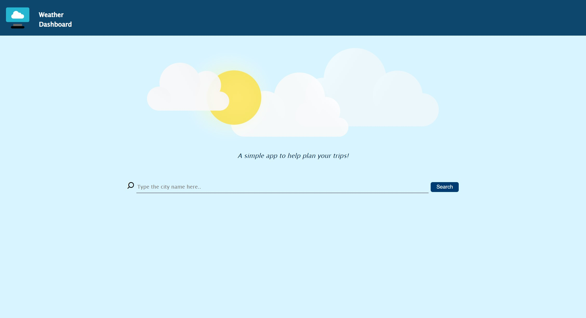

# Weather Dashboard

Weather dashboard is a simple web application that provides real-time weather information and a five-day forecast for any city. 

The user simply needs to enter the name of the city and the application will display the current temperature, humidity, wind speed, and a detailed forecast for the next five days. The interface is user-friendly and easy to navigate, making it a convenient tool for anyone looking to plan their day or week ahead.

# How to use the application

Simply enter the city name in the search bar on the home page and the app will fetch the latest weather update from the OpenWeather platform.

The application will store your previous searches to save you from typing the same search in future. Simple click on the city you like to search from the history and the app will get it for you.

# Screenshots

## Desktop
### Home page

### 5 Day forecast

## Mobile
### Homepage

### 5 Day forecast

